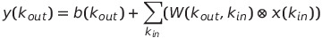
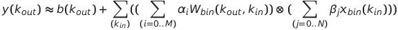
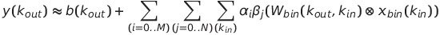
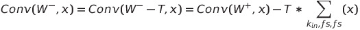
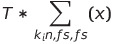

# Reconfigurable Binary Engine (RBE)
The Reconfigurable Binary Engine (RBE) is a Deep Neural Network accelerator which uses some of the Hardware Processing Engine (HWPE) concepts [1] and is designed to be integrated in a PULPOpen cluster configuration via the Heterogeneous Cluster Interconnect (HCI). It makes use of the interface IPs 'hci', 'hwpe-ctrl', and 'hwpe-stream'.

In general the RBE has built-in HW supports the following features:

- Filters: 1x1, 3x3
- Batch normalization
- ReLU
- Activation input bits: 2,3,4,5,6,7,8
- Weight bits: 2,3,4,5,6,7,8
- Activation output bits: 2,3,4,5,6,7,8
- Nr of input channels: any multiple of 32
- Nr of output channels: any multiple of 32

## Contributors
 - Gianna Paulin, ETH Zürich (*pauling@iis.ee.ethz.ch*)
 - Francesco Conti, University of Bologna (*f.conti@unibo.it*)

## Computational Model
For supporting the aforementioned features the RBE architecture exploits the following two mathematical concepts.

### Binary Based Quantization (BBQ)
RBE aims to have a freely configurable accuracy allowing to balance the power and
performance vs accuracy tradeoff. The design is inspired by the
ABC-Net [2] which is based on the following two innovations:

1. Linear combination of multiple binary weight bases.
2. Employing multiple binary activations to alleviate the information loss.

The RBE architecture uses the two innovations to emulate quantized NNs by choosing
the binary weights to correspond to each bit of the quantized weights. One quantized
NN can therefore be emulated by a superposition of power-of-2 weighted QA×QW binary
NN, whereas QW corresponds to the quantization level of the weights and QA quantization
level of the activations. We call this concept from now on
**Binary Based Quantization (BBQ)** which allows the RBE to perform convolutions
with configurable arithmetic precisions in a flexible and power-scalable way.
BBQ can be applied on both complete NNs and single layers.

In practice,



is approximated as





### Negative Weights: Offset Computation
For supporting positive and negative weights the RBE makes use of a special shifting of the negative
weights to positive. and applying the following (simplified) algorithm to compute the convolutions:



As this offset  is dependent on the input features x, it cannot
be computed in advance and loaded into it but should in the best case be computed on the
accelerator. As the offset is the same for every output channel of a single output pixel,
it can be computed once and then being reused over all output channels which results in a
higher throughput than the old schemes. The overhead is only 2 cycles per 32xQW (where QW means number of weight bits) instead of 1 cycle every QW cycles.

## Architecture
More information on the architecture can be found in the `./docs` directory.

# Usage
The RBE can be simulated together with the *RBE Testbench*. For it's usage, please check the corresponding `README.md`.

Run the following command in a bash shell for listing all execution options:
```
make help
```

## Repository Organization
The main directories of this repository are:

- `./docs` - contains the architecture and more documentation
- `./model` - contains python-based golden models. For the verification three golden models were developed:
  - a simple golden model based on BBQ
  - a simple golden model checking Offest Computation (for negative weights)
  - a bittrue golden model for the RBE which was cross-verified with the two simple models
- `./rtl` - contains the sourcecode of the RBE accelerator, including wrappers.
- `./ucode` - contains the ucode can be loaded into the memory-mapped control registers. The code defines
  loops with loop boundaries which are executed by the `ucode` unit in the RBE's control module.
  - `code.yml` - gives an overview of the by default executed loops
  - `uloop_compile.py` - generates the ucode loops and bytecode to be loaded into the accelerator.
  - `uloop_common.py` - package for the uloop scripts.
  - `uloop_run.py` - simulates the uloop execution.

# License
This repository makes use of two licenses:
- for all *software*: Apache License Version 2.0
- for all *hardware*: Solderpad Hardware License Version 0.51

For further information have a look at the license files: `LICENSE.hw`, `LICENSE.sw`

# References
[1] F. Conti, P. Schiavone, and L Benini. "XNOR neural engine: A hardware accelerator IP for 21.6-fJ/op binary neural network inference." IEEE Transactions on Computer-Aided Design of Integrated Circuits and Systems 37.11 (2018): 2940-2951.

[2] X. Lin, C. Zhao and W. Pan. "Towards Accurate Binary Convolutional Neural Network." Advances in Neural Information Processing Systems, 2017.
