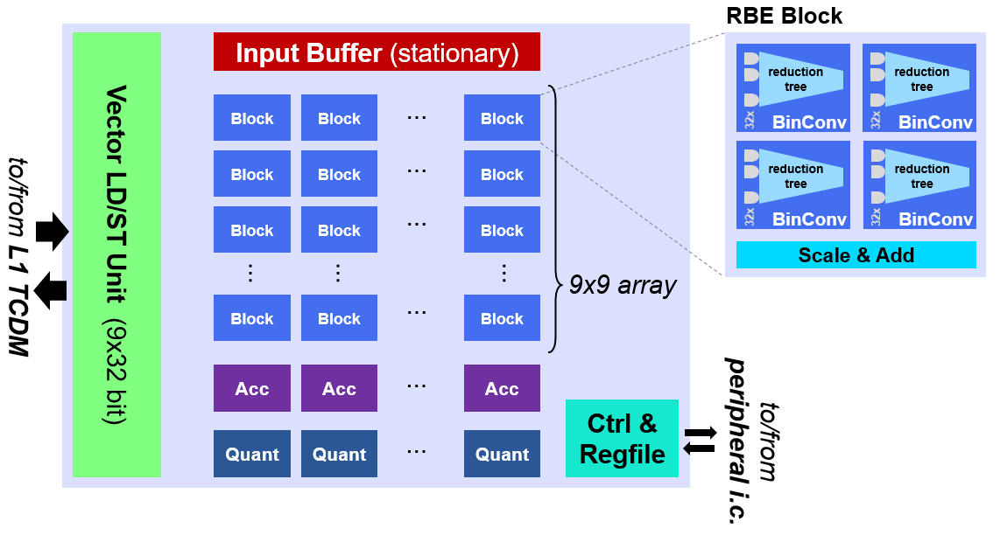
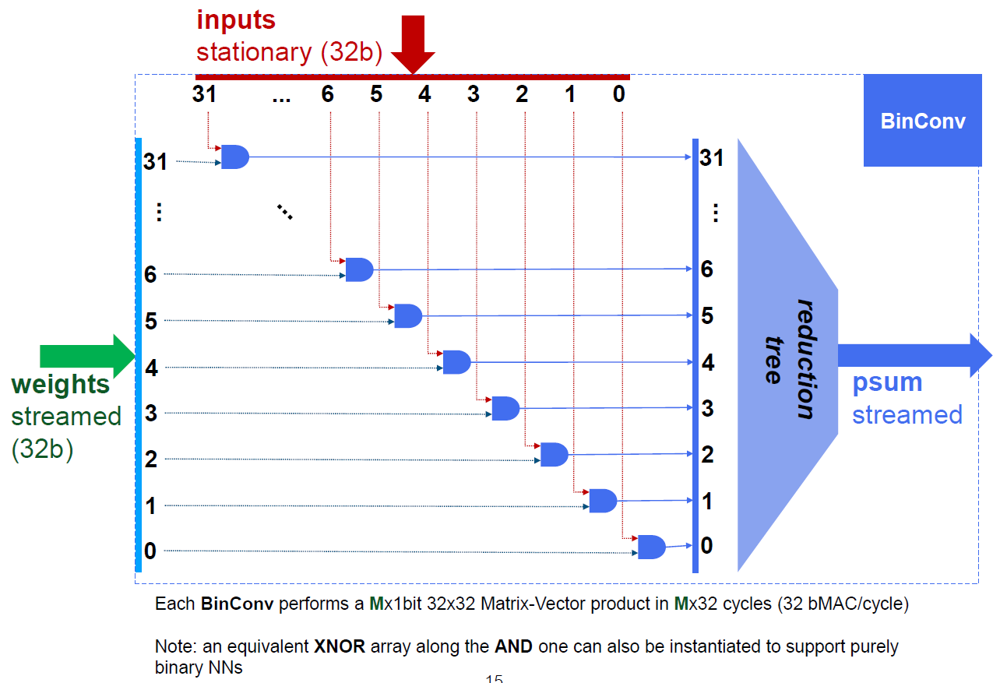
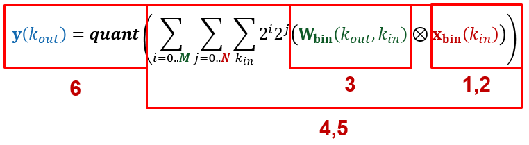
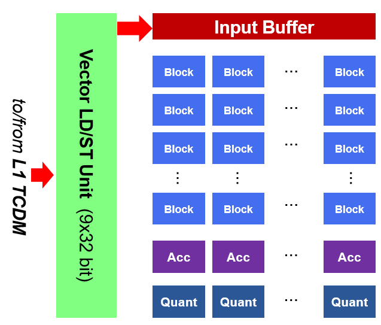
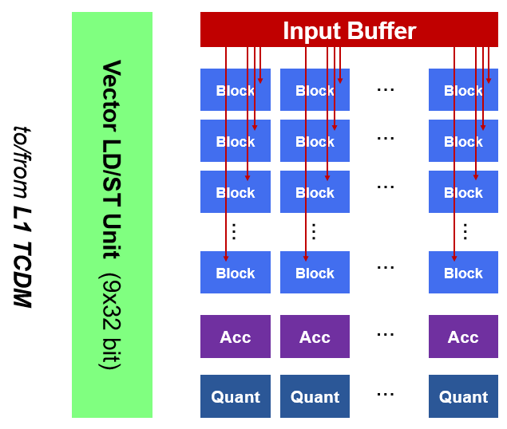
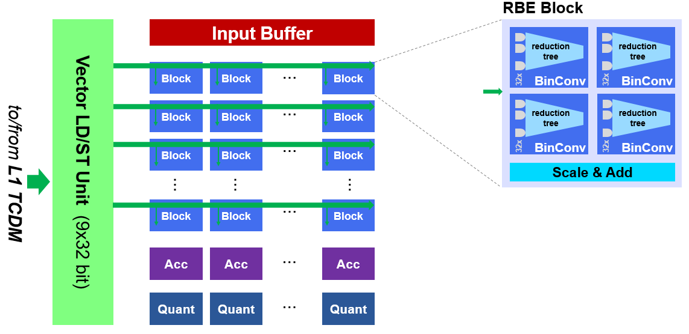
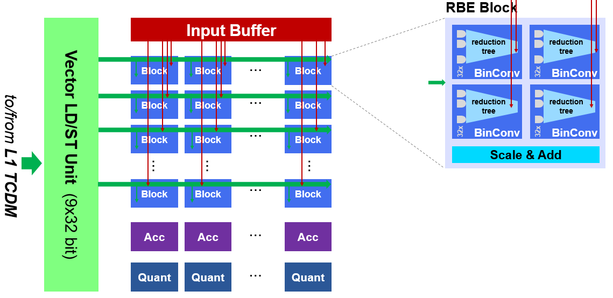
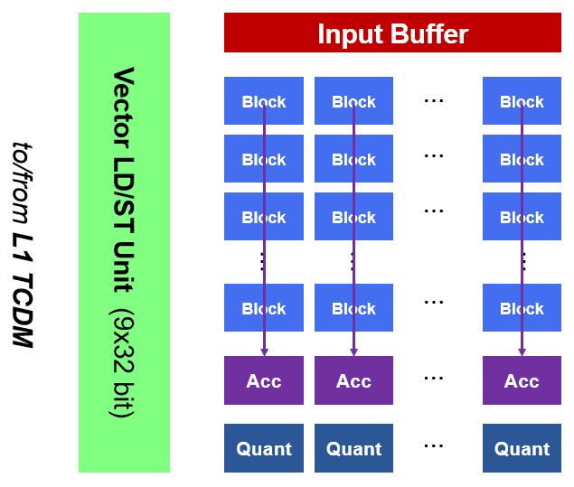
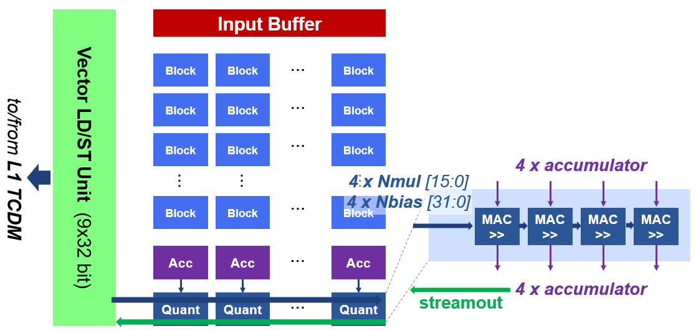

# Architecture
This document gives an overview of the hardware architecture of RBE.

## RBE - Reconfigurable Binary Engine
The RBE accelerator constis of three parts:
- **Control Unit** - contains all control related logic:
  - Whole tensor tile is handled in a single job, helped by HWPE uloop (tiny microcoded loop processor)
  - Classic HWPE programming interface + hardwired controller
- **Streamer Unit** - handles all request
  - Source - includes the address and request generation for reading data from the TCDM memory
  - Sink - includes the address and request generation for writing data back to the TCDM memory
- **Engine Unit** - performs all computation. The unit includes the following modules:
  - a grid of 9x9=81 **Block** units (9 columns of each 9 Block units)
  - each **Block** includes 4 Binary Convolution Engines, or short **Binconv**, modules
  - each **Binconv**  performs a QW x 1bit 32x32 Matrix-Vector product in QW x 32 cycles (32 bMAC/cycle)
  - The reduced **Binconv** results are scaled by a power-of-two and accumulated
  - The accumulated results of all block in one of the 9 Columns are again accumulated and stored in the **Accumulator** Banks
  - After the full accumulation, the values are quantized by the **Quantization** module and streamed out

### Control Unit
TODO

### Streamer
TODO

### Engine
Here an overview of the RBE Engine:

#### Binary Convolution Engine (BinConv)

## Functional Concept
Let's define an examplary small network which can be run on RBE:
- number bits for weights QW = 4 bits
- number bits for input activations QA = 4 bits
- number bits for output activations QAO = 4 bits
- 32 input channels
- 32 output channels
- input image size: 5x5 pixel
- 3x3 filter

In the following the computational flow on RBE for the example NN:
1. preload input buffer with input activations (here 5x5 pixels, 32 input channels, QA=4 bits/pixel)
2. each of the 81 block units has as input one of the 25 px (32x4 bits)
3. 9 filters x 32 channels of binary weights streamed each cycle; weight bits are muxed in QW=4 cycles
4. the RBE blocks perform binary MV products, scale and combine partial results
5. results are added column-wise and accumulated in 32-bit accumulator banks (9x32x32 bits) for many iterations until full accumulation
6. after full accumulation, the accumulator values are quantized and streamed out

### Step 1

### Step 2

### Step 3

### Step 4

### Step 5

### Step 6
