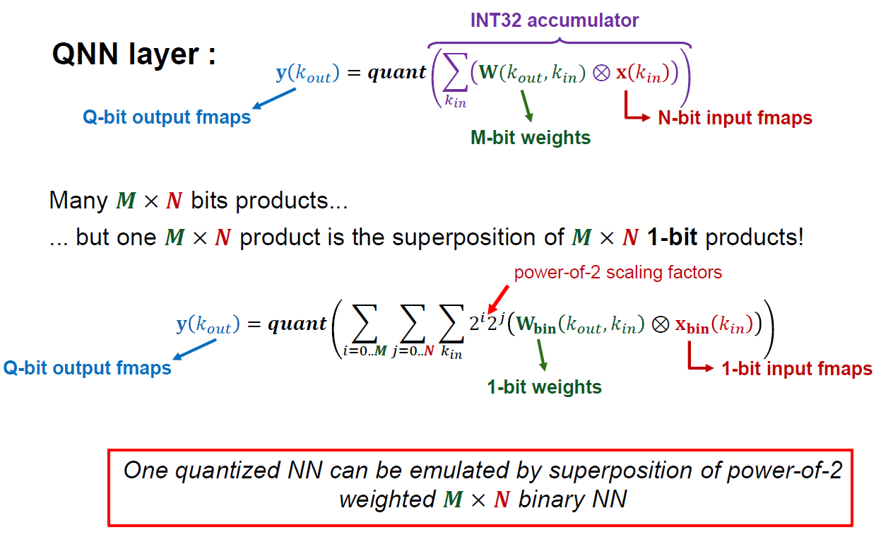

# Computational Concept

## BBQ - Binary Based Quantization (BBQ)
RBE aims to have a freely configurable accuracy allowing to balance the power and
performance vs accuracy tradeoff. The design is inspired by the
ABC-Net [2] which is based on the following two innovations:

1. Linear combination of multiple binary weight bases.
2. Employing multiple binary activations to alleviate the information loss.

The RBE architecture uses the two innovations to emulate quantized NNs by choosing
the binary weights to correspond to each bit of the quantized weights. One quantized
NN can therefore be emulated by a superposition of power-of-2 weighted QA×QW binary
NN, whereas QW corresponds to the quantization level of the weights and QA quantization
level of the activations. We call this concept from now on
**Binary Based Quantization (BBQ)** which allows the RBE to perform convolutions
with configurable arithmetic precisions in a flexible and power-scalable way.
BBQ can be applied on both complete NNs and single layers.

In practice,

is approximated as

Here an overview of the concept:

